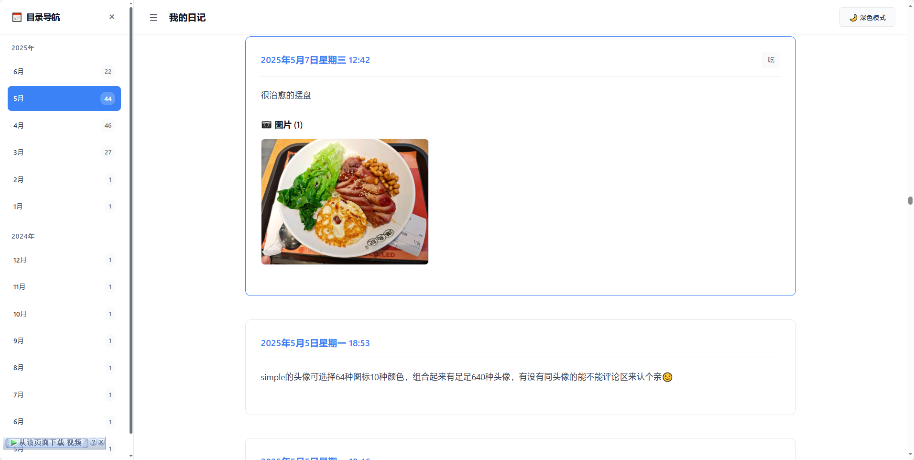

# 📚 Simple备份文件可视化工具

> 将Simple平台的JSON备份文件转换为精美的HTML网页和PDF文档

一个专为Simple平台用户设计的现代化Web应用，能够将JSON格式的日记备份数据转换为美观、易读的HTML网页或PDF文档。


## 🌟 功能亮点

### 📱 现代化界面
- **类Notion设计风格** - 简洁优雅的用户界面
- **响应式布局** - 完美适配桌面端和移动端
- **深色/浅色主题** - 支持主题切换，护眼夜间模式
- **流畅动画** - 丝滑的交互体验和过渡效果

### 🎯 专为Simple优化
- **智能兼容性** - 自动修复Simple导出文件的格式问题
- **完整数据支持** - 支持文字、图片、视频、音频等多媒体内容
- **标签和分类** - 完整保留Simple的标签和分类信息
- **时间轴展示** - 按月份自动分组，清晰的时间线

### 📄 双格式输出
- **HTML网页** (推荐) - 完整功能、完美主题、侧边栏导航
- **PDF文档** - 适合打印和分享的传统格式

### 🎨 HTML特色功能
- **侧边栏导航** - 按年月分组的快速导航
- **主题切换器** - 一键切换深色/浅色模式
- **图片预览** - 点击图片查看大图
- **音频播放** - 内置音频播放器
- **标签交互** - 悬停效果和视觉反馈

## 📸 效果预览




## 🚀 快速开始

### 🎯 一键启动 (推荐)

#### **方式1：PowerShell脚本（推荐）**
适用于Windows 10/11，解决编码问题：
```powershell
# 右键点击项目文件夹，选择"在此处打开PowerShell窗口"
# 或在PowerShell中进入项目目录后运行：
.\启动.ps1
```

#### **方式2：批处理文件**
适用于Windows：
```bash
# 双击运行
启动.bat
```

#### **方式3：Shell脚本**
适用于Linux/Mac：
```bash
# 赋予执行权限并运行
chmod +x 启动.sh
./启动.sh
```

### 🔧 手动启动（开发者）
<<<<<<< HEAD
如果自动脚本遇到问题，可以参照以下步骤手动执行。

**在 Windows (PowerShell) 中:**
```powershell
# 1. 安装根目录依赖
npm install

# 2. 安装前端依赖
cd client
npm install
cd ..

# 3. 安装后端依赖
cd server
npm install
cd ..

# 4. 启动应用
npm run dev
```

**在 Linux / Mac / Git Bash 中:**
```bash
# 1. 安装所有依赖
=======
如果自动脚本遇到问题：
```bash
# 1. 安装依赖
>>>>>>> aea728735c9d33f737f3bbe34ed9cf7e4cd4ac68
npm install
cd client && npm install
cd ../server && npm install
cd ..

# 2. 启动应用
npm run dev
```

### 📋 系统要求

- **Node.js** 16+ (推荐 18+ 或 20+)
- **现代浏览器** (Chrome 88+, Firefox 85+, Safari 14+)
- **可用内存** 512MB+
- **磁盘空间** 1GB+ (用于临时文件处理)

### ⚡ 首次运行

1. **获取项目**
   ```bash
   # 方式1：Git克隆（推荐）
   git clone https://github.com/XiuDayyds/simple-backup-visualizer.git
   cd simple-backup-visualizer
   
   # 方式2：下载ZIP
   # 访问GitHub页面 → Code → Download ZIP → 解压
   ```

2. **一键启动**
   ```bash
   # Windows（推荐PowerShell）
   .\启动.ps1
   
   # Windows（批处理）
   启动.bat
   
   # Linux/Mac
   ./启动.sh
   ```

3. **访问应用**
   - 🌐 前端界面: http://localhost:5173
   - 🔧 后端API: http://localhost:3000

## 🔧 常见问题解决

<<<<<<< HEAD
### ❌ **启动脚本执行失败或报错**
**问题**: 运行 `.\启动.ps1` 时出现红字错误，如 `数组索引表达式丢失或无效` 或其他语法错误。

**原因**:
这通常是由于PowerShell执行环境的差异或脚本文件编码问题导致的。

**解决方案**:
1.  **使用更新后的脚本**: 项目中的 `启动.ps1` 脚本已经过重构，增强了健壮性，通常可以解决此类问题。请确保您使用的是最新版本。
2.  **检查执行策略**: 如果脚本无法执行，可能是PowerShell的执行策略限制。请以管理员身份运行PowerShell，然后执行：
    ```powershell
    Set-ExecutionPolicy RemoteSigned -Scope CurrentUser
    ```
3.  **手动分步执行**: 如果脚本仍然失败，请尝试上方 "手动启动（开发者）" 部分提供的PowerShell分步指令。
=======
### ❌ **启动脚本出现乱码**
**问题**: Windows批处理文件显示乱码字符

**解决方案**:
1. **使用PowerShell脚本（推荐）**:
   ```powershell
   .\启动.ps1
   ```

2. **手动启动**:
   ```bash
   npm install
   npm run dev
   ```

3. **修改PowerShell执行策略**（如果需要）:
   ```powershell
   # 以管理员身份运行PowerShell
   Set-ExecutionPolicy RemoteSigned -Scope CurrentUser
   ```
>>>>>>> aea728735c9d33f737f3bbe34ed9cf7e4cd4ac68

### 🌐 **网络相关问题**
**npm安装失败**:
```bash
# 使用国内镜像
npm config set registry https://registry.npmmirror.com/

# 或使用cnpm
npm install -g cnpm
cnpm install
```

### 📝 **权限问题**
**Windows**: 右键选择"以管理员身份运行"
**Linux/Mac**: 使用`sudo`权限

### 🔌 **端口占用**
<<<<<<< HEAD
**问题**: 启动时出现 `EADDRINUSE` 错误，表示端口已被占用。

**解决方案**:
- **自动清理**: 新版的 `启动.ps1` 脚本会自动尝试清理之前残留的Node.js进程。建议优先使用此脚本。
- **手动检查**:
  - **前端端口 (默认 5173)**: 如果被占用，Vite通常会自动尝试使用下一个可用端口 (如 5174)，一般无需手动干预。
  - **后端端口 (默认 3000)**: 如果被占用，请检查是否有其他服务（或本应用的上一个实例）正在使用该端口。您可以手动结束该进程，或修改 `server/.env` 文件中的 `PORT` 值来更换端口。
=======
**前端端口5173被占用**: 修改`client/vite.config.ts`
**后端端口3000被占用**: 修改`server/.env`中的`PORT`
>>>>>>> aea728735c9d33f737f3bbe34ed9cf7e4cd4ac68

## 📖 使用指南

### 📁 准备数据文件

1. **从Simple平台导出备份**
   - 登录Simple平台
   - 进入设置 → 数据导出
   - 下载JSON格式的备份文件

2. **支持的数据格式**
   ```json
   [
     {
       "date": "2025-01-15 14:30:25",
       "content": "今天天气很好，心情愉悦！",
       "collection": "日常随笔",
       "album": [
         {
           "type": "image",
           "url": "https://example.com/photo.jpg"
         },
         {
           "type": "video", 
           "url": "https://example.com/video.mp4"
         }
       ],
       "audio": "https://example.com/voice.m4a",
       "tags": ["生活", "心情", "天气"]
     }
   ]
   ```

### 🎮 使用步骤

1. **📤 上传文件**
   - 拖拽JSON文件到上传区域
   - 或点击选择文件上传
   - 自动检测并修复格式问题

2. **👀 预览数据**
   - 查看解析统计信息
   - 预览前5条记录内容
   - 确认数据完整性

3. **⚙️ 配置选项**
   - 设置文档标题和作者
   - 选择输出格式 (HTML/PDF)
   - 配置主题和样式选项

4. **📄 生成文档**
   - 点击生成按钮
   - 等待处理完成
   - 下载生成的文件

### 🎨 HTML功能说明

生成的HTML文件包含以下特色功能：

- **📑 侧边栏导航**: 按年份和月份分组，快速跳转
- **🌓 主题切换**: 右上角主题切换按钮
- **🖼️ 图片预览**: 点击图片查看大图
- **🎵 音频播放**: 完整的音频播放控件
- **🎬 视频播放**: 内置视频播放器
- **🏷️ 标签互动**: 悬停效果和视觉反馈
- **📱 移动适配**: 完美的手机端体验

## 🏗️ 项目架构

```
simple-backup-visualizer/
├── 📁 client/                    # 前端应用 (React + TypeScript)
│   ├── src/
│   │   ├── components/           # UI组件
│   │   │   ├── FileUploader.tsx        # 文件上传
│   │   │   ├── DataPreview.tsx         # 数据预览
│   │   │   ├── DocumentGenerator.tsx   # 文档生成配置
│   │   │   ├── Header.tsx              # 页头组件
│   │   │   └── Footer.tsx              # 页脚组件
│   │   ├── services/             # API服务
│   │   ├── types/               # TypeScript类型
│   │   └── utils/               # 工具函数
│   └── package.json
├── 📁 server/                   # 后端服务 (Node.js + Express)
│   ├── src/
│   │   ├── routes/              # API路由
│   │   │   ├── health.ts              # 健康检查
│   │   │   └── pdf.ts                 # 文档生成API
│   │   ├── services/            # 核心服务
│   │   │   ├── htmlGenerator.ts       # HTML生成器
│   │   │   ├── pdfGenerator.ts        # PDF生成器
│   │   │   ├── imageProcessor.ts      # 图片处理
│   │   │   └── mediaProcessor.ts      # 媒体文件处理
│   │   └── utils/               # 工具模块
│   ├── uploads/                 # 上传文件临时存储
│   ├── output/                  # 生成文件输出
│   └── temp/                    # 临时文件处理
├── 🚀 启动.ps1                 # PowerShell启动脚本（推荐）
├── 🚀 启动.bat                 # Windows批处理启动脚本
├── 🚀 启动.sh                  # Linux/Mac Shell启动脚本
├── 📝 package.json             # 项目配置
└── 📖 README.md
```

## 🛠️ 技术栈

### 前端技术
- **React 18** - 现代化UI框架
- **TypeScript** - 类型安全开发
- **Tailwind CSS** - 原子化CSS框架
- **Vite** - 极速构建工具
- **React Hot Toast** - 优雅的消息提示
- **React Dropzone** - 文件拖拽上传
- **Lucide React** - 现代图标库

### 后端技术
- **Node.js + Express** - 服务器框架
- **TypeScript** - 类型安全后端
- **Puppeteer** - 无头浏览器PDF生成
- **Sharp** - 高性能图片处理
- **Multer** - 文件上传中间件
- **UUID** - 唯一标识符生成

## ⚙️ 配置说明

### 环境变量配置

创建 `server/.env` 文件：

```bash
# 🌐 服务器配置
PORT=3000
NODE_ENV=development

# 🔒 跨域配置  
CORS_ORIGIN=http://localhost:5173

# 📁 文件配置
MAX_FILE_SIZE=10485760          # 最大文件大小 10MB
TEMP_DIR_CLEANUP_HOURS=24       # 临时文件清理时间

# 📄 文档生成配置
PUPPETEER_TIMEOUT=30000         # PDF生成超时时间
DEFAULT_THEME=light             # 默认主题

# 🖼️ 图片处理配置
IMAGE_QUALITY=80                # 图片质量
IMAGE_MAX_WIDTH=1200           # 图片最大宽度
IMAGE_MAX_HEIGHT=800           # 图片最大高度
```

### 开发命令

```bash
# 📦 安装依赖
npm run install:all

# 🚀 开发模式 (前端+后端)
npm run dev

# 🎨 仅前端开发
npm run dev:client

# 🖥️ 仅后端开发  
npm run dev:server

# 🏗️ 构建生产版本
npm run build:all

# 🧹 清理构建文件
npm run clean
```

### 性能优化建议

- **大文件处理**: 对于大量数据，建议分批上传
- **图片优化**: 建议图片大小控制在2MB以内
- **内存使用**: 处理大文件时关闭其他占用内存的应用

## 📸 效果展示

### 🌅 浅色主题
- 清新简洁的界面设计
- 适合日间使用的明亮配色
- 清晰的内容层次和视觉分割

### 🌙 深色主题  
- 护眼的深色背景
- 适合夜间使用的暗色调
- 减少蓝光，保护视力

### 📱 移动端适配
- 响应式侧边栏导航
- 触摸友好的交互设计
- 优化的移动端布局

## 🎖️ 特别鸣谢

- **Simple平台** - 优秀的记录分享平台
- **守望者用户铮烬** - 项目发起和需求提供

## 📞 联系方式

- 🐙 GitHub: [@铮烬](https://github.com/XiuDayyds)
- 💬 Simple平台: [@铮烬](https://simple.imsummer.cn/shareFriend?id=ca57f94d-7707-4093-8ffa-4bda63b6a8b9)

---

<div align="center">

**🎉 感谢使用Simple备份文件可视化工具！**

如果这个项目对您有帮助，请给我们一个 ⭐

</div> 